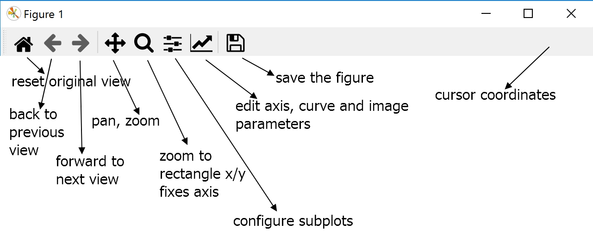

=======================
Introduction DataFrame
=======================

When visualising data it often is important to first check the data, in which
case use a dataframe before plotting the results. Matplotlib is often
used, especially with more complicated plots, and does not always need to use 
a dataframe.

.. plot:: pyplots/sine.py
    :include-source:

When plotted on python there is a toolbar shown which gives some interaction
to the user. 

    Matplotlib Interactive Toolbar
    
    The cursor coordinates are not constrained to the plot.

Seaborn is built up on matplotlib ensure the data is assigned to x and y,
otherwise it will show a "TypeError"::

    import matplotlib.pyplot as plt
    import seaborn as sns

    sns.set_theme(style="darkgrid")

    x = [1, 2, 3, 4, 5]
    y = [1, 5, 4, 7, 4]

    sns.lineplot(x, y)
    plt.show()
    
    TypeError: lineplot() takes from 0 to 1 positional arguments but 2 were given

corrected

.. plot:: pyplots/sea0.py
    :include-source:

When working with Altair one requires to explicitly state the source, then
the library interperets the data type. One can use either a dataframe or a
dictionary, when working with Jupyter lab it will show automatically::

    import altair as alt
    
    x = [1, 2, 3, 4, 5]
    y = [1, 5, 4, 7, 4]
    
    dict = {'x': x, 'y': y}
    
    alt.Chart(dict).mark_line().encode(x='x', y='y')

The data frame is optional for plotly::

    import plotly.express as px
    
    x = [1, 2, 3, 4, 5]
    y = [1, 5, 4, 7, 4]
    
    fig = px.line(x=x, y=y)
    fig.show()

The plot shows as a web page which has a toolbar with options,

    * Download plot as png
    * Zoom
    * Pan
    * Zoom in
    * Zoom out
    * Autoscale
    * Reset axes

It also has a popup cursor coloured in the plot colour showing the coordinates
of the data points/markers.

Just as we had done for Altair, Plotly can use a dictionary::

    import plotly.express as px
    
    x = [1, 2, 3, 4, 5]
    y = [1, 5, 4, 7, 4]
    
    dict = {'x': x, 'y': y}
    dict
    {'x': [1, 2, 3, 4, 5], 'y': [1, 5, 4, 7, 4]}
    
    fig = px.line(dict, x = "x", y = "y")
    fig.show()

Whenever a dictionary or the plotting becomes complex it is best to change
over to a data frame, this applies to the other libraries as well::

    import plotly.express as px
    import pandas as pd
    
    df = pd.DataFrame({'x': [1, 2, 3, 4, 5],
                       'y': [1, 5, 4, 7, 4]})
    df
       x  y
    0  1  1
    1  2  5
    2  3  4
    3  4  7
    4  5  4
    
    fig = px.line(df, x = "x", y = "y")
    fig.show()

Notice how the data has been transformed from essentially a horizontal view,
lists or dictionary, to a vertical one, with **'x'** and **'y'** becoming
column names. The column of digits on the left is an index. Plotting libraries
examples often use type of layout, which is the long layout. Normally the
long format is the most suitable but there are exceptions related to 
plotting methods.

* wide-form data 
    has one row per independent variable, with metadata recorded in the row 
    and column labels.

* long-form data has one row per observation, with metadata recorded within 
    the table as values.

When the data is supplied as lists or mathematical/scientific formulae there
should be no reason to expect corrupted data, but for many applications this
cannot be assumed. This is where working in the dataframe using Pandas is
often necessary.

Many dataframes are stored as csv files or come from a website. If the 
complete file can be easily viewed on a screen then working with Pandas may
be not so necessary, however there may well be a case to check the data with
a plot to ensure that all is correct.