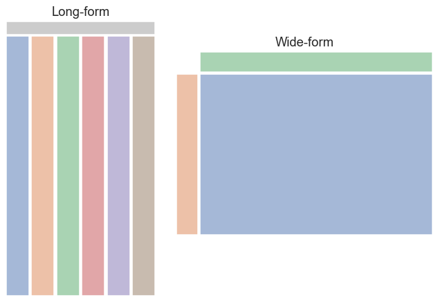

============
Loading Data
============

Long and Wide Form
==================

    
    Left hand image long-form, right hand image wide-form
    
    From the Seaborn documents.

Data should be in long format, this means that every column refers
to a variable, and every row is the observed data. This follows the format
of most databases.

   +-----+------+-------+------------+
   |     | year | month | passengers |
   +=====+======+=======+============+
   |**0**| 1949 | Jan   | 112        |
   +-----+------+-------+------------+
   |**1**| 1949 | Feb   | 118        |
   +-----+------+-------+------------+
   |**2**| 1949 | Mar   | 132        |
   +-----+------+-------+------------+
   |**3**| 1949 | Apr   | 129        |
   +-----+------+-------+------------+
   |**4**| 1949 | May   | 121        |
   +-----+------+-------+------------+

See how data is repeated within the year column, the month column repeats
for each year.

Not all data arrives in this format, often it is in wide format. This means 
that the first row and first column are both
variables and each cell is data.
When there is a large number of variables then the long form is
superior, but the wide form is probably easier to visualise as a table with
two or three variables.

    ========  =====  =====  =====  =====  =====  =====  =====  =====  =====  =====  =====  =====
    month     Jan    Feb    Mar    Apr    May    Jun    Jul    Aug    Sep    Oct    Nov    Dec
    ========  =====  =====  =====  =====  =====  =====  =====  =====  =====  =====  =====  =====
    **year**  ..     ..     ..     ..     ..     ..     ..     ..     ..     ..     ..     ..
    **1949**  112    118    132    129    121    135    148    148    136    119    104    118
    **1950**  115    126    141    135    125    149    170    170    158    133    114    140
    **1951**  145    150    178    163    172    178    199    199    184    162    146    166
    **1952**  171    180    193    181    183    218    230    242    209    191    172    194
    **1953**  196    196    236    235    229    243    264    272    237    211    180    201
    ========  =====  =====  =====  =====  =====  =====  =====  =====  =====  =====  =====  =====

None of the year or month data is repeated, but then the name **passengers**
has been lost.

If data has to be converted to long format it might only need a simple
transformation such as a table pivot or transpose. More complex changes may 
need the Pandas method ``pandas.DataFrame.melt()``.

For a more comprehensive discussion see `Long-form vs. wide-form data <https://seaborn.pydata.org/tutorial/data_structure.html>`_

Data Loading
============

Data can be loaded directly by typing it in, which probably applies to 
practice sessions, or more likely directly from a saved file. The structure
is similar to treeview, there
are columns with a header and rows of data, which can be expanded down the 
page. As a practical limit keep the number of columns to the screen width,
although many tutorials have much larger sizes::

    import pandas as pd
    
    # create a dictionary
    data = {'Product': ['Tablet','Printer','Laptop','Monitor'],
        'Price': [250,100,1200,300]
        }
    
    # load directly into dataframe
    df = pd.DataFrame(data)
    # the dictionary keys become columns
    print(df)
    
       Product  Price
    0   Tablet    250
    1  Printer    100
    2   Laptop   1200
    3  Monitor    300

Note that a dictionary is usually a wide format although with only two keys 
and columns it could be mistaken for a long format, see also :ref:`melt <wide>`.

The dataframe easily produces a list::

    products_list = df.values.tolist()
    print(products_list)
    
    [['Tablet', 250], ['Printer', 100], ['Laptop', 1200], ['Monitor', 300]]

Iteratively appending rows to a DataFrame can be more computationally 
intensive than a single concatenate. A better solution is to append 
those rows to a list and then concatenate the list with the original 
DataFrame all at once::

    df1 = pd.DataFrame({'Product': ['Tablet','Printer','Laptop'],
        'Price': [250,100,1200]})
    
    df2 = pd.DataFrame({'Product': ['Monitor'], 'Price': [300]})
    
    # append is deprecated
    # df3 = df1.append(df2, ignore_index=True)
    df3 = pd.concat([df1, df2], ignore_index=True)
    df3
       Product  Price
    0   Tablet    250
    1  Printer    100
    2   Laptop   1200
    3  Monitor    300

When concating use the same columns names, **ignore_index=True** is required 
or else
the index no longer has unique values, alternatively load a list::

    l1 = ['Mouse', 10]
    
    # locate the end of the dataframe 
    # df3 is overwritten
    df3.loc[len(df3)] = l1
    df3
       Product  Price
    0   Tablet    250
    1  Printer    100
    2   Laptop   1200
    3  Monitor    300
    4    Mouse     10

Load csv data directly from disk or from a known URL source::

    df = pd.read_csv("file_path/beer_list.csv")

    url = 'https://raw.githubusercontent.com/Vibe1990/Netflix-Project/main/netflix_title.csv'
    df = pd.read_csv(url)

Other formats are accessible although additional 
`dependancies <https://pandas.pydata.org/pandas-docs/stable/getting_started/install.html>`_
might be necessary

* Jason
    read_json()
* HTML
    read_html()
* XML
    read_xml()
* SQL
    read_sql()
* Excel
    read_excel()
