Visualising Data
----------------

Pandas works well with Matplotlib and consequently Seaborn. Once the data
is plotted outlyers can be quickly seen. Most plots are 2D, but sometimes it is 
important to see the relationship with more than 2 variables. Use colours to 
show string variables, categorized variables might be shown as different point
types and changing the size of the points might show another variable. 

When first visualising data start with simple plots to highlight the strong
and weak relationships and to check on the data. Once the data has been 
cleaned then the output can be selected and customised for publishing. 
In the following plot Plotly was used, this was saved as an html file which
allows one to use cursors with balloon text, which is nice to have on a site
such as this.

.. raw:: html
    :file: ../pyplots/beers4.html

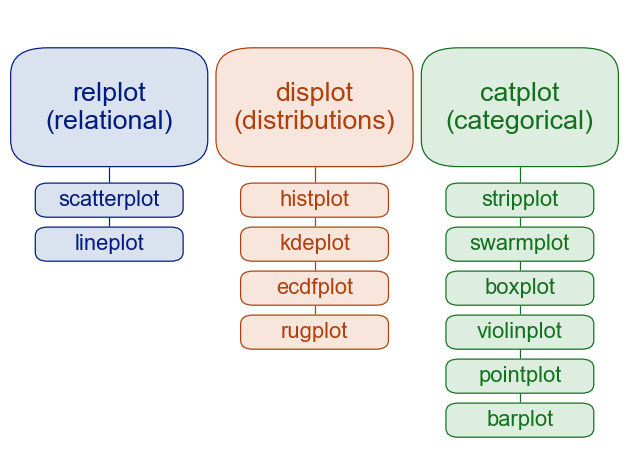
    
    Seaborn Methods of plotting.
    
    The first row after the headers are default values.

Seaborn works well when working interactively, if necessary add mplcursors 
to obtain a cursor as balloon text.

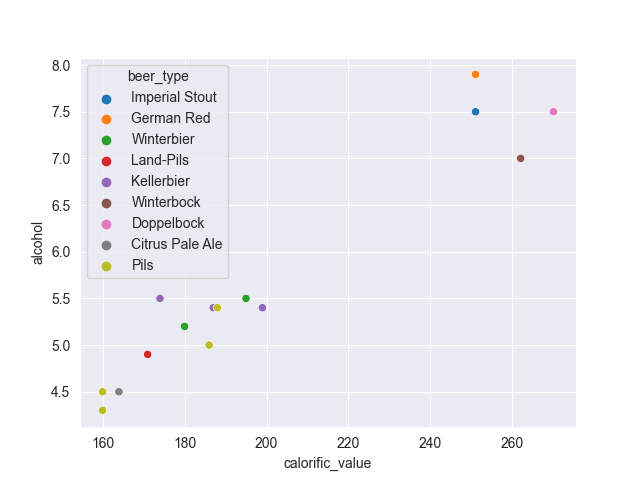

.. container:: toggle

    .. container:: header

        *Show/Hide Code* brewery_sea_hue.py

    .. literalinclude:: ../pyplots/brewery_sea_hue.py

.. note:: Plotting in Sphinx

    In order to display the actual Seaborn plots the modules are reimported
    for each script, when working interactively this is not required.

The first seaborn script shows a similar plot to the plotly script, as one
would use in an interactive session. The colours of the points are probably 
good enough for the final plot, Plotly colours were based on the
seaborn palette so the customised seaborn plot has a matching palette.

.. container:: toggle

    .. container:: header

        *Show/Hide Code* brewery_custom_hue.py

    .. literalinclude:: ../pyplots/brewery_custom_hue.py

This seaborn plot shows how to customise the hue with a dictionary, adding
overall title, axes labels and legend title. Mplcursors has been added to
give balloon cursors, as a result ensure that the column **original_extract**
has been converted to numeric, or else the float format will not work (used
on the balloon cursor). The empty values in the column **calorific_value**
throws the cursor indexing so two
of the Pils points showed up as Pilsner Urquelle on the cursor instead of 
Zlaty Bazant or Topvar, so drop these rows::

    df = df.dropna(subset=['calorific_value'])

.. hint:: View the Balloon Cursors Working

    Load the script into a Python session.

.. sidebar:: Large Scatterplots with Overlapping Points

    If there is a lot of overlapping points on the scatterplot consider
    using pandas hexagonal plot::
    
        ax = df.plot.hexbin(x='x', y='y', gridsize=20)
        plt.show()

When there are several columns of data it may be useful to check on 
correlations across the columns. In this instance use pairplots, which are
well supported in Seaborn. Each column is paired with every other column
and then shown again with opposite axes. Pairing every column often makes 
little sense, select those columns that are related. 

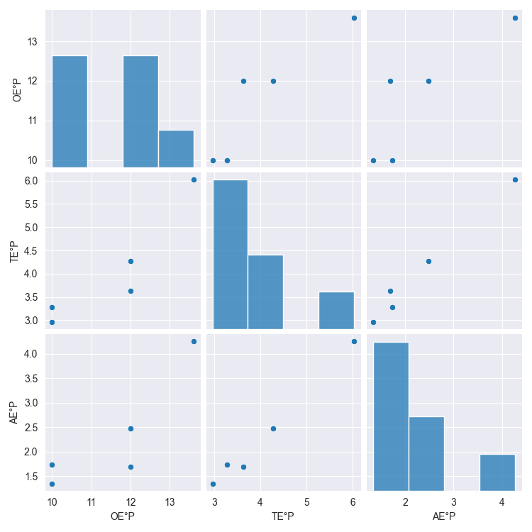

.. container:: toggle

    .. container:: header

        *Show/Hide Code* brew_list_paired.py

    .. literalinclude:: ../pyplots/brew_list_paired.py

Change the diagonal from histogram to kernel density estimate (KDE)

.. figure:: ../figures/br_list_paired_kde.png
    :width: 750
    :height: 750
    :align: center

.. container:: toggle

    .. container:: header

        *Show/Hide Code* brew_list_paired_kde.py

    .. literalinclude:: ../pyplots/brew_list_paired_kde.py

Change the columns to **AbV% AbW%**, alcohol by volume and weight in %, these
ought to be in a straight line, check by drawing a regression line.

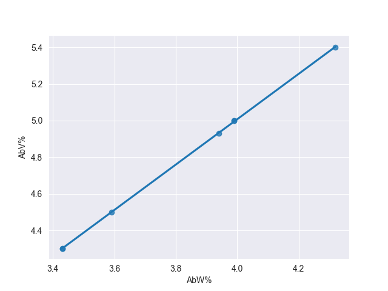

.. container:: toggle

    .. container:: header

        *Show/Hide Code* brew_list_scatter_regression.py

    .. literalinclude:: ../pyplots/brew_list_scatter_regression.py

Now try with the wort and beer densities.

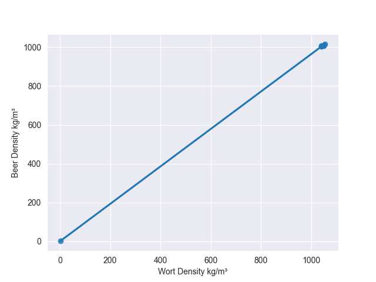

.. container:: toggle

    .. container:: header

        *Show/Hide Code* brew_list_regplot_densities.py

    .. literalinclude:: ../pyplots/brew_list_regplot_densities.py

The densities show up the fact that there is some false data here, these need
to be recalculated for Zlaty Bazant 12. Change the wort density to 1048.37
and the beer density to 1009.69. Zlaty Bazant 12 and Pilsner Urquelle 12 are
similar.

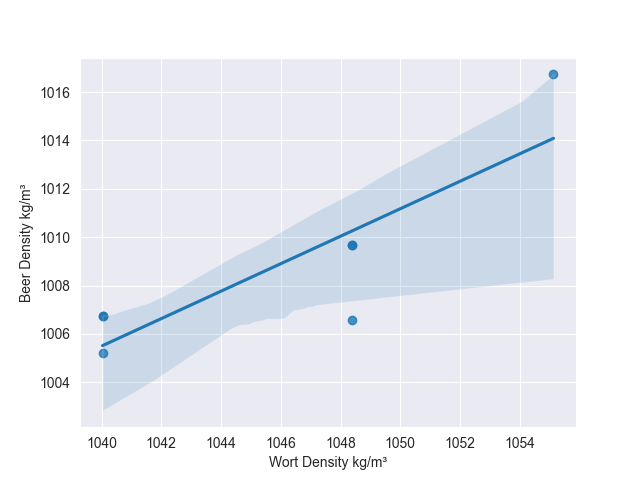

.. container:: toggle

    .. container:: header

        *Show/Hide Code* brew_list_regplot_densities_rev.py

    .. literalinclude:: ../pyplots/brew_list_regplot_densities_rev.py

If there is a strong relationship between 3 variables, consider a heat map.
Just as done with categorized data the third variable shows as a color, but
the colour is graduated to visualize the value of the third variable. Seaborn
provides a good platform to plot the data, select the columns which may be 
related, then use the correlation function and plot the heatmap.

.. sidebar:: Using Heatmaps to show Missing Data

    On large dataframes (df) it often is useful to highlight the degree of 
    missing values by column::

        sns.heatmap(df.isnull(),yticklabels=False,cbar=False,cmap='viridis')

    Complete information shows purple and missing information as yellow.

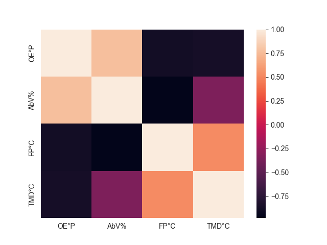

.. container:: toggle

    .. container:: header

        *Show/Hide Code* brew_list_heatmap.py

    .. literalinclude:: ../pyplots/brew_list_heatmap.py

Positive correlation shows that the two independant variables move in the
same direction, negative shows they move in opposite directions. The 
correlation function goes from +1.0 to -1.0. When using the correlation
function both x and y axes contain the reduced number of columns, otherwise
the heat map would have used all the columns in the y axis and just the 
reduced number of columns for the x axis::

    dfch.corr()
               OE°P      AbV%      FP°C     TMD°C
    OE°P   1.000000  0.770224 -0.880483 -0.865756
    AbV%   0.770224  1.000000 -0.980466 -0.347714
    FP°C  -0.880483 -0.980466  1.000000  0.525171
    TMD°C -0.865756 -0.347714  0.525171  1.000000

If the default colours are not clear enough use a divergent colour map.

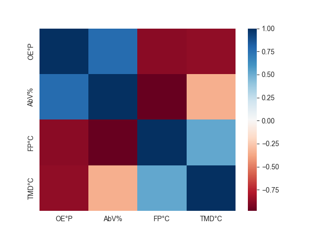

.. container:: toggle

    .. container:: header

        *Show/Hide Code* brew_list_heatmap_div.py

    .. literalinclude:: ../pyplots/brew_list_heatmap_div.py

After using a heatmap consider using a clustermap. This highlights how 
similar features are grouped.

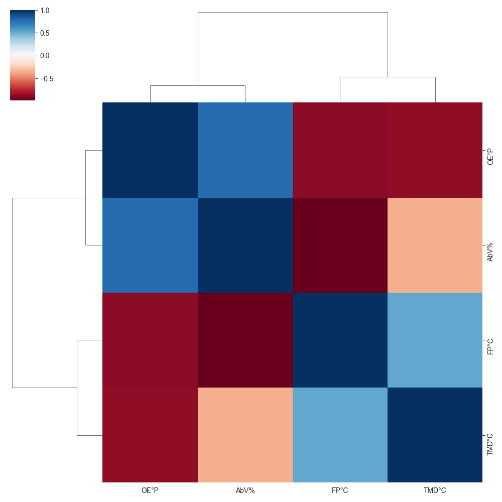

.. container:: toggle

    .. container:: header

        *Show/Hide Code* brew_list_clustermap_div.py

    .. literalinclude:: ../pyplots/brew_list_clustermap_div.py

Statisical Visualisation
^^^^^^^^^^^^^^^^^^^^^^^^

With larger dataframes some form of statistical visualisation may be 
required. Running KDE options has already been shown in principle together
with linear regression data and confidence limits. This can be extended in 
Seaborn by using box and violin plots. 

The boxplot splits the distribution
of the data into four quartiles, the middle two are the box element, the outer
two are the whisker elements, outlyers are shown be points beyond the whiskers.
The box is divided at the median. The ends of the whiskers show the calculated
minimum and maximum values. All this assumes the data lies in a bell shaped
distribution.

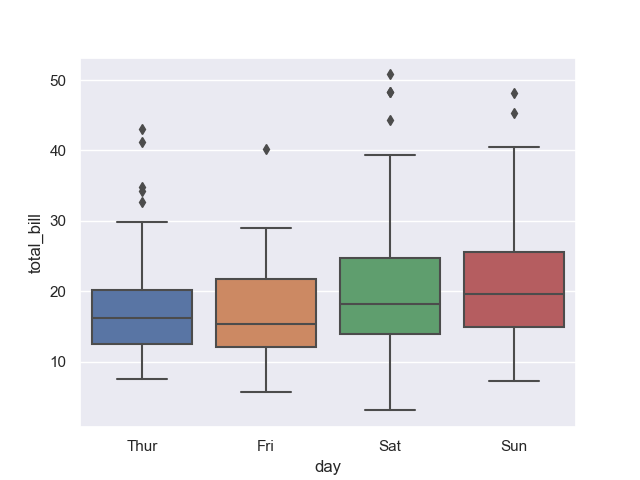

.. container:: toggle

    .. container:: header

        *Show/Hide Code* tips_box.py

    .. literalinclude:: ../pyplots/tips_box.py

The violin plot shows the distribution of quantitative data across several 
levels of one (or more) categorical variables in order to compare 
distributions. Underlying the plot are KDE distributions so ensure that 
there is enough data so that the plots are not artificially smoothed.

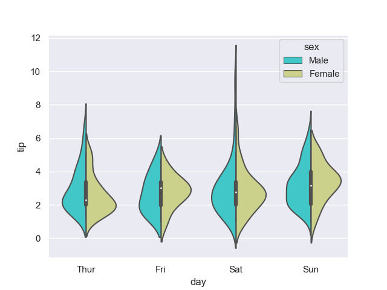

.. container:: toggle

    .. container:: header

        *Show/Hide Code* tips_violin.py

    .. literalinclude:: ../pyplots/tips_violin.py

A nice feature is that two categorical datatypes can be compared directly.

A strip plot can be used on its own or in combination with a box or violin 
plot. 

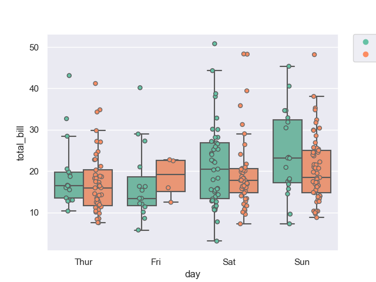

.. container:: toggle

    .. container:: header

        *Show/Hide Code* tips_box_strip.py

    .. literalinclude:: ../pyplots/tips_box_strip.py

When using the violin plot the mean/standard bar might be masked by the
stripplot points, bring this forward by adding **zorder=1**.

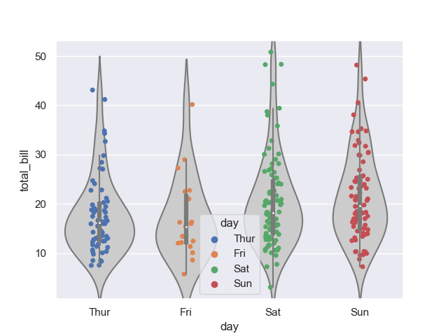

.. container:: toggle

    .. container:: header

        *Show/Hide Code* tips_violin_strip.py

    .. literalinclude:: ../pyplots/tips_violin_strip.py

To make a plot with multiple facets, it is safer to use catplot() than 
to work with FacetGrid directly, because catplot() will ensure that the 
categorical and hue variables are properly synchronized in each facet.

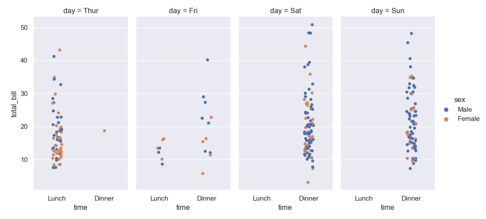

.. container:: toggle

    .. container:: header

        *Show/Hide Code* tips_catplot.py

    .. literalinclude:: ../pyplots/tips_catplot.py

A swarmplot is similar to the striplot, but the points have automatically
adjusted, so jitter is not required.

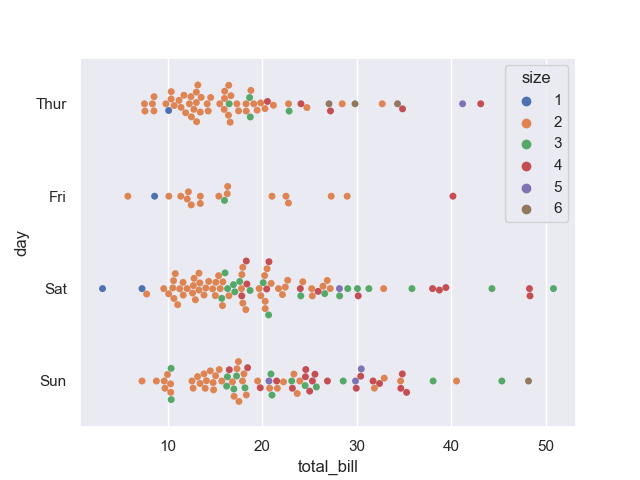

.. container:: toggle

    .. container:: header

        *Show/Hide Code* tips_swarmplot.py

    .. literalinclude:: ../pyplots/tips_swarmplot.py

Storage Format
--------------

Select the storage format that best suits your requirements. Both csv and 
pickle formats are easily loaded and saved from python scripts. A good
`review <https://towardsdatascience.com/the-best-format-to-save-pandas-data-414dca023e0d>`_ 
has been made, which compares how well different formats perform when saving
loading with memory and storage usage. For smaller dataframes csv is 
acceptable but think of different formats for larger dataframes. As always
test thoroughly before changing formats.

